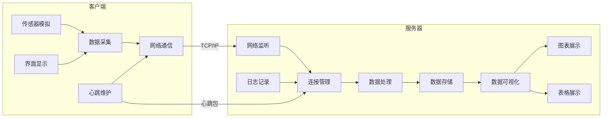
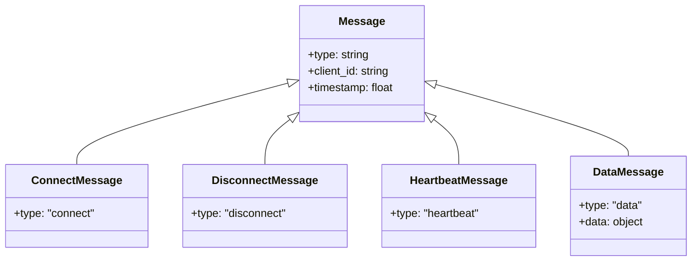
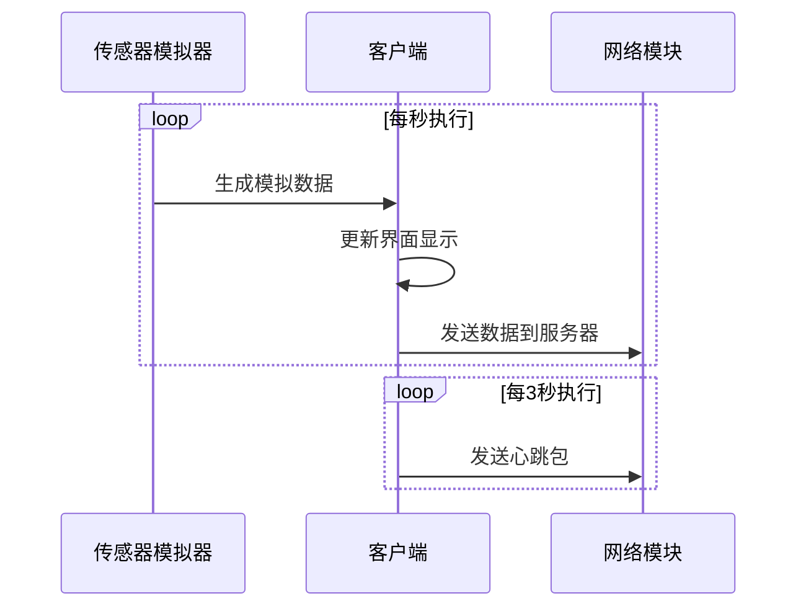
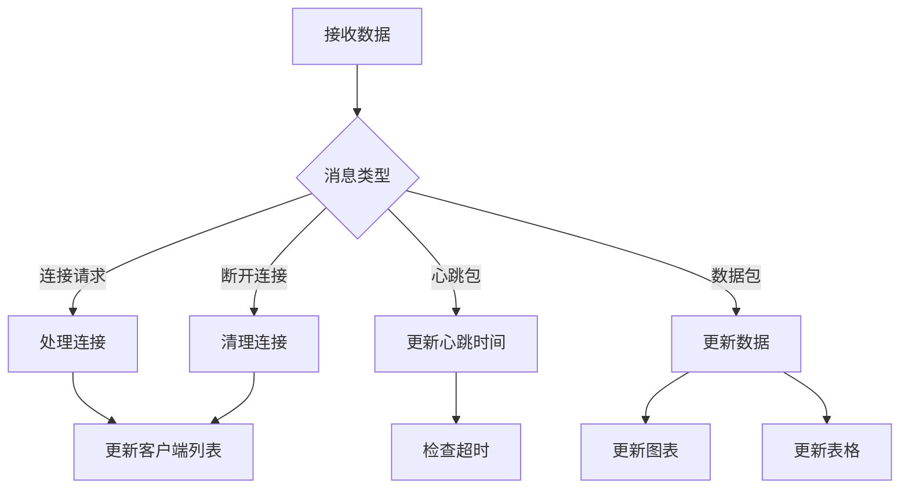

# 传感器数据采集系统实验报告

## 一、实验目的

1. 掌握基于 TCP/IP 的网络编程技术
2. 学习客户端/服务器架构的设计与实现
3. 理解实时数据采集与可视化的原理
4. 实践 PyQt5 图形界面应用程序开发
5. 掌握多线程编程和定时器的使用方法

## 二、实验内容

本实验设计并实现了一个基于 TCP/IP 的传感器数据采集系统。系统由客户端和服务器两部分组成，客户端负责模拟传感器数据的采集，并通过网络实时发送到服务器。服务器能够接收多个客户端的数据，并进行实时显示。系统实现了客户端的连接管理和心跳检测功能，确保客户端与服务器的连接稳定。数据在服务器端以图形化的方式展示，并保留历史记录。系统还支持多客户端数据的分组显示和查询，提供了良好的用户交互体验。

## 三、总体设计

### 3.1 功能结构

系统采用典型的C/S架构，分为客户端和服务器两个主要部分。每个部分都采用模块化设计，以提高代码的可维护性和可扩展性。

#### 3.1.1 系统整体架构



系统采用典型的C/S架构设计，主要分为客户端和服务器两大模块。

客户端模块负责生成模拟传感器数据，并定时采集和预处理这些数据。通过网络通信模块，客户端将数据发送到服务器，并通过界面显示模块提供用户交互界面。同时，心跳维护模块确保客户端与服务器的连接状态。

服务器模块负责处理客户端连接请求，并维护客户端的连接状态。接收到的数据由数据处理模块进行分析和处理，随后存储在数据存储模块中。服务器通过数据可视化模块以图表和表格形式展示数据，并通过日志记录模块记录系统的运行状态。


#### 3.1.2 客户端核心模块

1. **传感器模拟模块**
```python
class SensorSimulator:
    """传感器模拟器"""
    def __init__(self):
        self.base_temp = 25.0  # 基准温度
        self.base_humidity = 60.0  # 基准湿度
        
    def get_sensor_data(self) -> Dict[str, float]:
        """生成模拟的传感器数据"""
        return {
            'temperature': self.base_temp + random.uniform(-5, 5),
            'humidity': self.base_humidity + random.uniform(-10, 10)
        }
```

2. **数据采集模块**
数据采集模块负责通过定时器控制采集频率，定时采集传感器数据，并对采集到的数据进行缓存和预处理，以确保数据的有效可靠。
```python
# 创建数据上报定时器
self.data_timer = QTimer()
self.data_timer.timeout.connect(self._send_sensor_data)
self.data_timer.start(1000)  # 每秒采集一次数据
```

3. **网络通信模块**
网络通信模块基于TCP实现可靠的数据传输，负责处理连接的建立与断开，同时支持数据的序列化和反序列化操作，以保证数据的完整性与高效传输。
```python
def connect_to_server(self, server: str, client_id: str):
    """连接到服务器"""
    host, port = self._parse_server_address(server)
    self.socket = socket.socket(socket.AF_INET, socket.SOCK_STREAM)
    self.socket.connect((host, port))
    self.socket.send(Protocol.create_connect_message(client_id))
```

4. **心跳维护模块**
心跳维护模块负责定时发送心跳包，以检测客户端的存活状态。
```python
def _send_heartbeat(self):
    """发送心跳包"""
    if self.socket and self.client_id and not self.is_paused:
        self.socket.send(Protocol.create_heartbeat_message(self.client_id))
```

#### 3.1.3 服务器核心模块

1. **网络监听模块**
网络监听模块负责处理客户端连接请求，并维护客户端的连接状态。
```python
def _accept_connections(self):
    """接受客户端连接的线程函数"""
    while not self.stop_event.is_set():
        client_socket, address = self.server_socket.accept()
        threading.Thread(target=self._handle_client,
                       args=(ClientInfo(client_socket, address),)).start()
```

2. **连接管理模块**
连接管理模块负责维护客户端的连接状态，处理客户端断开的情况，并实现心跳检测机制，以确保连接的稳定性和可靠性。
```python
def _check_heartbeats(self):
    """检查客户端心跳"""
    current_time = time.time()
    for client_id, client in self.clients.items():
        if client.status == "在线":
            time_since_last_heartbeat = current_time - client.last_heartbeat
            if time_since_last_heartbeat > 4:
                client.missed_heartbeats += 1
                if client.missed_heartbeats >= 3:
                    client.status = "离线"
```

3. **数据处理模块**
数据处理模块负责解析客户端数据，对数据进行分类和过滤，并实现数据的缓存功能，以提高数据管理的效率和可靠性。
```python
def _handle_data(self, client_id: str, data: Dict):
    """处理数据消息"""
    if client_id in self.clients:
        client = self.clients[client_id]
        client.temperature = data['temperature']
        client.humidity = data['humidity']
        self.window.update_client_data(
            client_id, 
            data['temperature'], 
            data['humidity']
        )
```

4. **数据可视化模块**
数据可视化模块支持实时数据的图表显示和表格展示，并提供数据筛选与分组功能，以便用户直观地分析和管理数据。
```python
def update_client_data(self, client_id: str, temperature: float, humidity: float):
    """更新客户端数据"""
    if client_id not in self.client_data_history:
        pen = pg.mkPen({
            'color': '#ff9933',
            'width': 2,
            'style': Qt.SolidLine
        })
        self.client_data_history[client_id] = {
            'temp': [],
            'humidity': [],
            'timestamps': [],
            'temp_curve': self.temp_plot.plot(pen=pen),
            'humidity_curve': self.humidity_plot.plot(pen=pen)
        }
```

### 3.2 通讯协议设计

采用基于 JSON 的自定义协议，支持以下消息类型：



## 四、详细设计与实现

### 4.1 数据采集客户端

#### 4.1.1 界面设计

客户端界面采用 PyQt5 实现，主要包含以下部分：
- 连接控制区：服务器地址输入、连接/断开按钮
- 数据显示区：实时温度和湿度显示
- 日志区：显示操作和状态信息

关键代码示例：
```python
def init_ui(self):
    """初始化UI"""
    self.setWindowTitle('传感器数据采集客户端')
    self.setMinimumSize(500, 400)
    
    # 创建连接控制部分
    conn_layout = QHBoxLayout()
    self.server_input = QLineEdit('localhost:5000')
    self.client_id_input = QLineEdit('client_001')
    self.connect_btn = QPushButton('连接')
    
    # 创建数据显示部分
    self.temp_label = QLabel('温度: --°C')
    self.humidity_label = QLabel('湿度: --%')
```

#### 4.1.2 数据采集流程



### 4.2 数据采集服务器

#### 4.2.1 界面设计

服务器界面分为四个主要区域：
- 控制区：服务器地址设置和启动/停止控制
- 客户端列表：显示所有连接的客户端状态
- 数据展示区：支持图表和表格两种视图
- 日志区：显示服务器运行状态

#### 4.2.2 数据处理流程



#### 4.2.3 图表显示实现

服务器使用 PyQtGraph 实现实时数据可视化，支持以下特性：
- 自动缩放和平移
- 多客户端数据分组显示
- 网格线和背景设置
- 实时更新和历史数据保留

关键代码示例：
```python
def update_client_data(self, client_id: str, temperature: float, humidity: float):
    """更新客户端数据"""
    if client_id not in self.client_data_history:
        # 使用橙色曲线
        pen = pg.mkPen({
            'color': '#ff9933',
            'width': 2,
            'style': Qt.SolidLine
        })
        
        self.client_data_history[client_id] = {
            'temp': [],
            'humidity': [],
            'timestamps': [],
            'temp_curve': self.temp_plot.plot(pen=pen),
            'humidity_curve': self.humidity_plot.plot(pen=pen)
        }
```
## 五、安装与使用

### 环境准备
推荐使用Python虚拟环境进行部署，以下是具体步骤：

#### 创建并激活虚拟环境
Windows系统：
```bash
python -m venv venv
.\venv\Scripts\activate
```
Linux/Mac系统：
```bash
python3 -m venv venv
source venv/bin/activate
```
### 安装依赖包

pip install -r requirements.txt
### 启动服务器
python start_server.py
服务器默认运行在 http://localhost:5000
### 启动客户端
python start_client.py
可以启动多个客户端实例来模拟多个传感器


## 六、总结

在这次课程设计中，我从零开始构建了一个完整的传感器数据采集系统。这个过程充满挑战，也让我收获颇丰。回顾整个开发过程，我深刻体会到理论知识与实践应用之间的差距，同时也真正理解了软件工程的重要性。

### (一) 架构设计的重要性
在项目初期，我花了很多时间思考系统架构，这个过程让我深刻理解了"磨刀不误砍柴工"的道理。良好的架构设计为后续开发节省了大量时间。采用模块化设计后，当需要修改数据生成算法时，只需要修改相应模块，而不会影响到其他部分的代码。

### (二) 网络编程的实践经验
网络编程是这个项目中最具挑战性的部分。我第一次真正理解了为什么需要心跳机制 —— 当系统运行一段时间后，经常会出现客户端无声无息断开连接的情况，而服务器却浑然不知。利用心跳机制，系统可以及时检测到掉线的客户端。

### (三) 项目开发的经验总结
这次课程设计是我第一次独立完成一个完整的项目，从需求分析到系统设计，从编码实现到调试部署，每一个环节都让我获益良多。期间虽然遇到了很多困难，比如 Socket 连接总是莫名其妙断开、多个客户端数据混乱、内存泄漏等问题，但最终都一一解决了。

最后，我要特别感谢老师的悉心指导。他在课上给我们展示了类似功能的系统，细心教我们分析代码，教导我们如何思考问题和解决问题。这次的项目经验让我对未来充满信心，我相信通过不断学习和实践，一定能够成为一名优秀的软件工程师。
