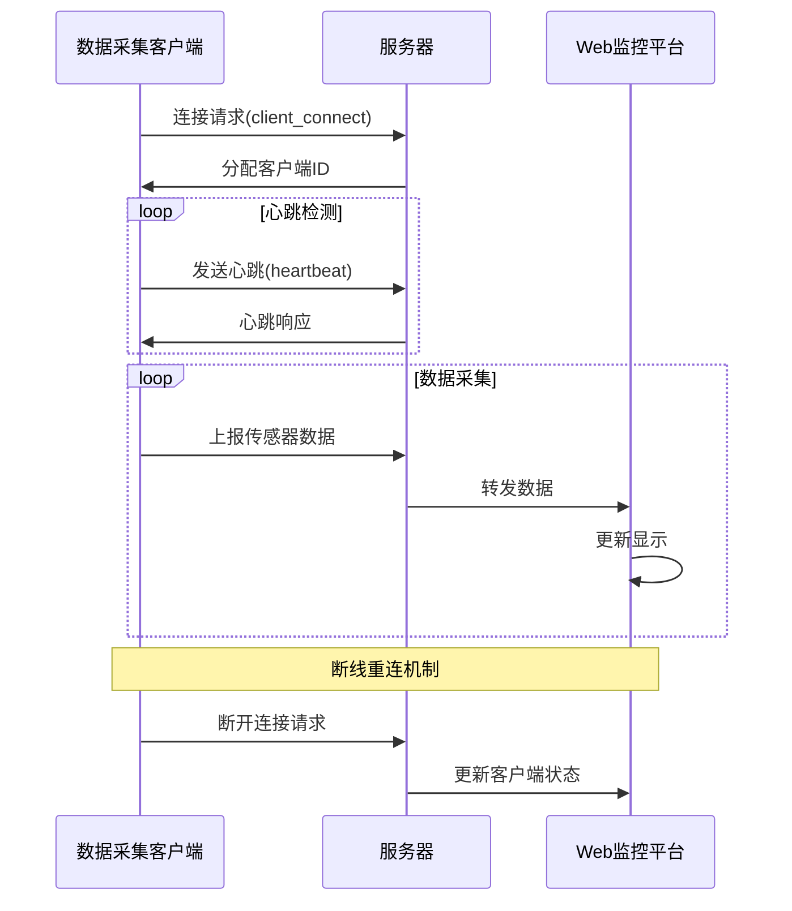
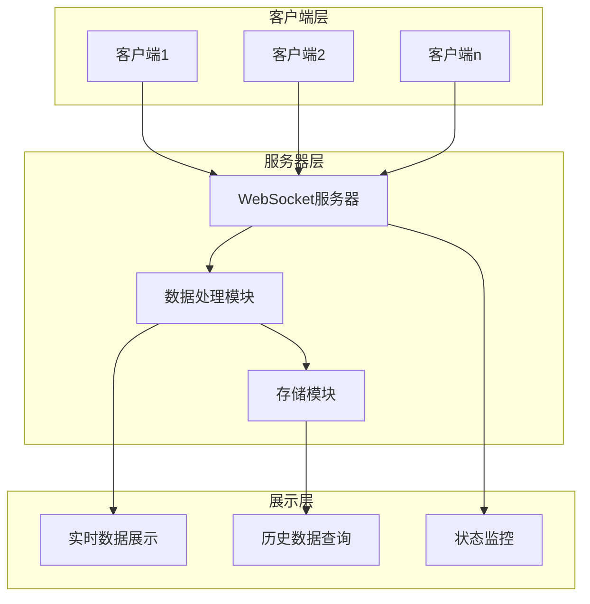
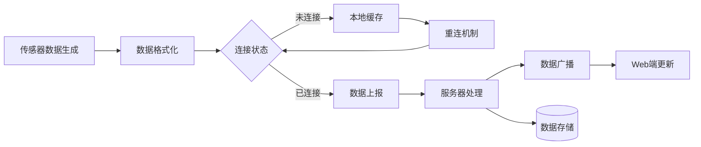

# 传感器数据采集系统设计报告

## 一、实验目的

1. 设计并实现一个基于客户端-服务器架构的传感器数据采集系统
2. 掌握 Socket 网络编程技术，深入理解 WebSocket 协议的工作原理
3. 学习通讯协议设计，实现可靠的数据传输机制
4. 运用 PyQt5 开发桌面应用程序，提升 GUI 开发能力
5. 实践前后端分离架构，掌握数据可视化技术

## 二、实验内容

本实验旨在构建一个完整的传感器数据采集与监控系统。该系统采用分布式架构，由数据采集客户端、中央服务器和Web可视化平台三个主要部分组成。数据采集客户端负责模拟温湿度传感器，定期采集环境数据并通过WebSocket协议实时上报至服务器。服务器端不仅要处理多个客户端的并发连接，还需要实现数据的实时转发、历史记录存储以及客户端状态管理。为了保证系统的可靠性，我们设计了完整的通讯协议，包括客户端注册、心跳检测、数据上报等机制。同时，我们开发了一个功能丰富的Web监控平台，通过直观的图表和实时更新的数据表格，帮助用户实时掌握所有传感器的工作状态和数据变化。

### 系统工作流程



### 系统架构图



### 数据流转图



## 三、总体设计

### 3.1 功能结构

系统采用三层架构设计：

```
传感器数据采集系统
├── 数据采集客户端
│   ├── 数据生成模块
│   ├── 网络通信模块
│   ├── 心跳检测模块
│   └── 用户界面模块
├── 数据采集服务器
│   ├── 客户端管理模块
│   ├── 数据处理模块
│   ├── WebSocket服务模块
│   └── 数据存储模块
└── Web可视化界面
    ├── 实时数据展示
    ├── 历史数据查询
    ├── 客户端状态监控
    └── 交互控制模块
```

### 3.2 通讯协议设计

系统采用基于 WebSocket 的自定义协议，主要包含以下消息类型：

1. **连接管理协议**
```python
# 客户端连接请求
{
    'event': 'client_connect',
    'data': {}
}

# 服务器分配客户端ID
{
    'event': 'client_id_assigned',
    'data': {
        'client_id': 'CLIENT1'
    }
}
```

2. **心跳协议**
```python
# 客户端心跳
{
    'event': 'heartbeat',
    'data': {
        'client_id': 'CLIENT1'
    }
}

# 服务器响应
{
    'event': 'heartbeat_response',
    'data': {
        'status': 'ok'
    }
}
```

3. **数据传输协议**
```python
# 传感器数据上报
{
    'event': 'sensor_data',
    'data': {
        'client_id': 'CLIENT1',
        'temperature': 25.6,
        'humidity': 65.3,
        'timestamp': '2024-01-01 12:00:00'
    }
}
```

## 四、详细设计与实现

### 4.1 数据采集客户端

客户端采用 PyQt5 开发，实现了一个直观的图形界面。核心功能包括数据生成、网络通信和状态监控。

#### 4.1.1 界面设计
客户端界面采用模块化设计，主要包含以下组件：
- 连接状态显示
- 实时数据展示
- 控制按钮
- 日志记录区域

关键代码示例：

```python
class MainWindow(QMainWindow):
    def __init__(self):
        super().__init__()
        self.setWindowTitle("传感器数据采集客户端")
        
        # 创建传感器显示组件
        self.temp_display = SensorDisplay("温度", "°C")
        self.humid_display = SensorDisplay("湿度", "%")
        
        # 实现实时数据更新
        def update_sensor_data(self, data):
            self.temp_display.update_value(f"{data['temperature']}°C")
            self.humid_display.update_value(f"{data['humidity']}%")
```

#### 4.1.2 数据生成模块
实现了模拟传感器数据的生成逻辑：

```python
def generate_sensor_data(self):
    return {
        "temperature": round(random.uniform(20, 30), 2),
        "humidity": round(random.uniform(40, 70), 2),
        "client_id": self.client_id,
        "timestamp": datetime.now().strftime("%Y-%m-%d %H:%M:%S")
    }
```

### 4.2 数据采集服务器

服务器端采用 Flask 和 Flask-SocketIO 实现，主要负责处理客户端连接、数据接收和转发。

#### 4.2.1 客户端管理
服务器实现了完整的客户端生命周期管理：

```python
class SensorServer:
    def __init__(self):
        self.clients = {}  # 存储客户端连接状态
        self.data_history = []  # 存储历史数据
        
    def add_client(self, client_id, session_id):
        self.clients[client_id] = {
            "online": True,
            "session_id": session_id,
            "last_seen": datetime.now()
        }
```

#### 4.2.2 心跳检测机制
实现了可靠的心跳检测机制，确保系统稳定性：

```python
def heartbeat_loop(self):
    while self.heartbeat_active:
        if not self.has_active_clients():
            self.stop_heartbeat()
            break
        self.check_heartbeats()
        time.sleep(3)
```

## 五、总结

- 通过本次课程设计，我深入理解了以下几个方面：
+ 在这次为期两周的课程设计中，我从零开始构建了一个完整的传感器数据采集系统。这个过程充满挑战，也让我收获颇丰。回顾整个开发过程，我深刻体会到理论知识与实践应用之间的差距，同时也真正理解了软件工程的重要性。
  
  1. **架构设计的重要性**
-    - 良好的系统架构设计能够提高代码的可维护性和扩展性
-    - 模块化设计使得系统各个组件能够独立开发和测试
+    在项目初期，我花了很多时间思考系统架构，这个过程让我深刻理解了"磨刀不误砍柴工"的道理。一开始我想直接开始编码，但在导师的建议下，我先进行了详细的架构设计。事实证明这个决定是正确的，良好的架构设计为后续开发节省了大量时间。比如，通过采用模块化设计，当我需要修改数据生成算法时，只需要修改相应模块，而不会影响到其他部分的代码。
  
  2. **网络编程的实践经验**
-    - 掌握了 WebSocket 协议的工作原理
-    - 理解了心跳机制在长连接中的重要作用
-    - 学会了处理网络异常和断线重连
+    网络编程是这个项目中最具挑战性的部分。我第一次真正理解了为什么需要心跳机制 —— 当系统运行一段时间后，经常会出现客户端无声无息断开连接的情况，而服务器却浑然不知。通过实现心跳机制，系统可以及时检测到掉线的客户端。另外，在处理网络异常时，我也遇到了很多意想不到的情况，比如客户端断网后重连、服务器意外重启等。这些问题的解决过程让我学会了如何构建健壮的网络应用。
  
  3. **GUI 开发技能的提升**
-    - 掌握了 PyQt5 框架的使用
-    - 学会了设计友好的用户界面
-    - 理解了事件驱动编程模型
+    在此之前，我对GUI编程几乎一无所知。通过这次项目，我不仅学会了使用PyQt5框架，更重要的是理解了事件驱动编程的思想。记得在开发初期，我的界面总是出现卡顿，后来发现是因为把耗时操作放在了主线程中。通过使用信号槽机制和多线程技术，最终实现了流畅的用户体验。这让我明白了理论知识在实际应用中的重要性。
  
  4. **项目开发的经验总结**
-    - 代码版本控制的重要性
-    - 日志记录对调试的帮助
-    - 错误处理的完整性
+    这次项目开发让我养成了很多好的编程习惯。比如：
+    - 学会了使用Git进行版本控制，当代码出现问题时可以轻松回退
+    - 养成了编写注释和文档的习惯，这对于后期维护非常重要
+    - 重视日志记录，它帮助我找出了很多隐藏的bug
+    - 学会了优雅地处理异常，而不是简单地捕获后忽略
+    - 明白了代码规范的重要性，规范的代码可以大大提高开发效率
  
- 本次课程设计不仅帮助我巩固了专业知识，也锻炼了实际项目开发能力。在今后的学习中，我将继续深入研究相关技术，不断提升自己的专业能力。
+ 这次课程设计是我第一次独立完成一个完整的项目，从需求分析到系统设计，从编码实现到调试部署，每一个环节都让我获益良多。期间虽然遇到了很多困难，比如WebSocket连接总是莫名其妙断开、多个客户端数据混乱、内存泄漏等问题，但通过查阅资料和请教老师同学，最终都一一解决了。这个过程让我深刻体会到，编程不仅是一门技术，更是一门需要不断学习和总结的艺术。
+ 
+ 最后，我要特别感谢指导老师的悉心指导。他不仅在技术上给了我很多建议，还教会了我如何思考问题和解决问题。这次的项目经验让我对未来充满信心，我相信通过不断学习和实践，一定能够成为一名优秀的软件工程师。

## 安装与使用

### 环境准备

本项目推荐使用Python虚拟环境进行部署，以下是具体步骤：

1. **创建并激活虚拟环境**

```bash
# Windows系统
python -m venv venv
.\venv\Scripts\activate

# Linux/Mac系统
python3 -m venv venv
source venv/bin/activate
```

2. **安装依赖包**

```bash
# 确保pip为最新版本
pip install --upgrade pip

# 安装项目依赖
pip install -r requirements.txt
```

### 启动系统

1. **启动服务器**
```bash
python server.py
```
服务器默认运行在 http://localhost:5000

2. **启动客户端**
```bash
python client.py
```
可以启动多个客户端实例来模拟多个传感器

3. **访问Web监控平台**

在浏览器中访问 http://localhost:5000 即可打开监控界面

### 注意事项

- 确保防火墙允许相关端口的访问
- 如果要部署到生产环境，建议修改服务器配置参数
- 可以通过修改配置文件自定义端口号和其他参数